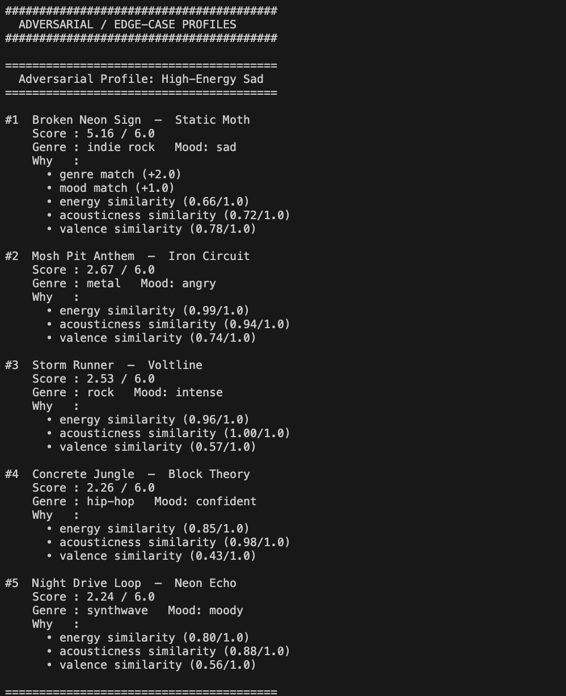
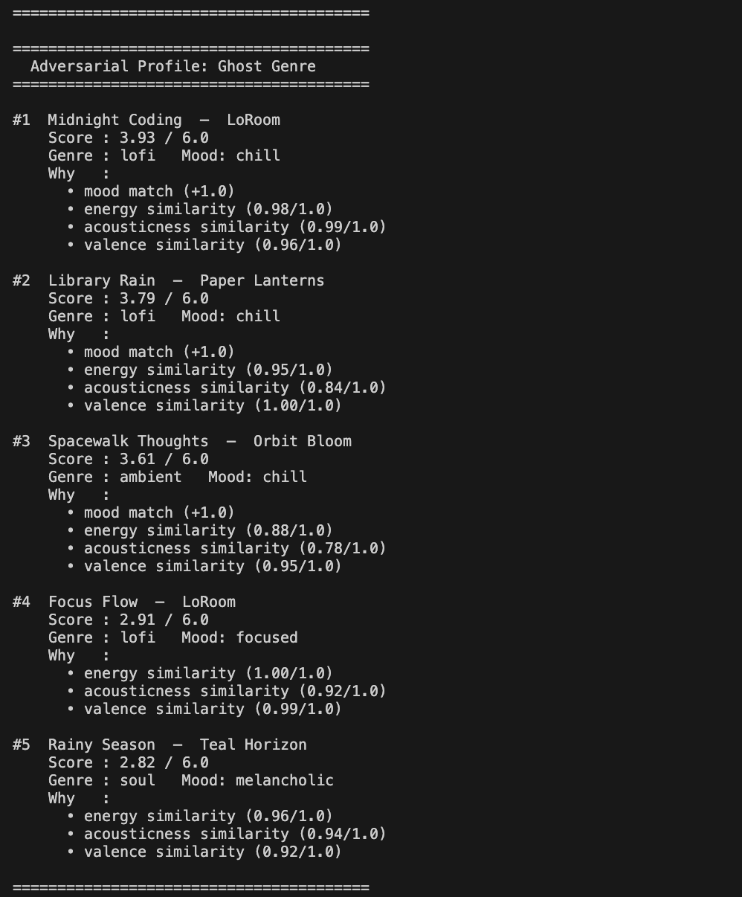
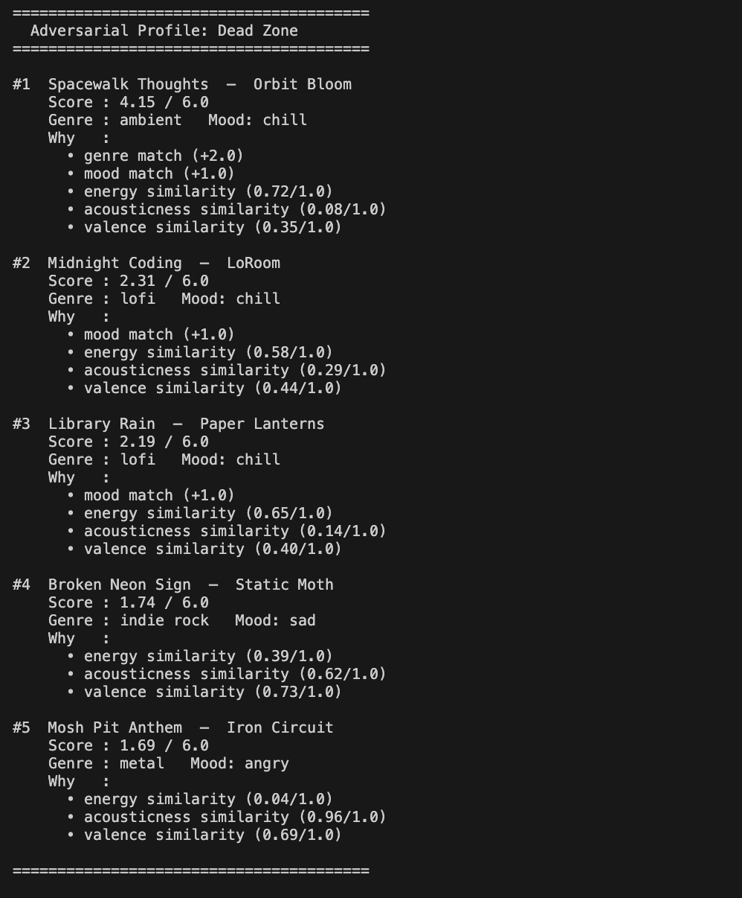
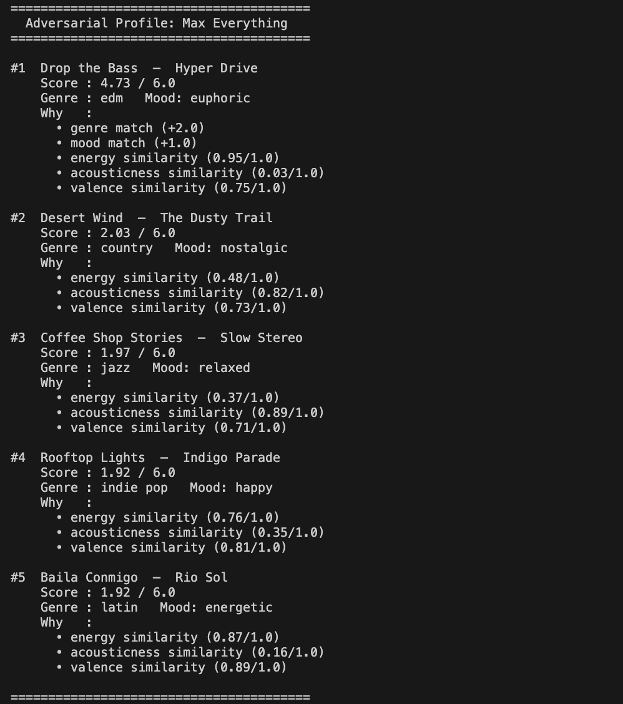
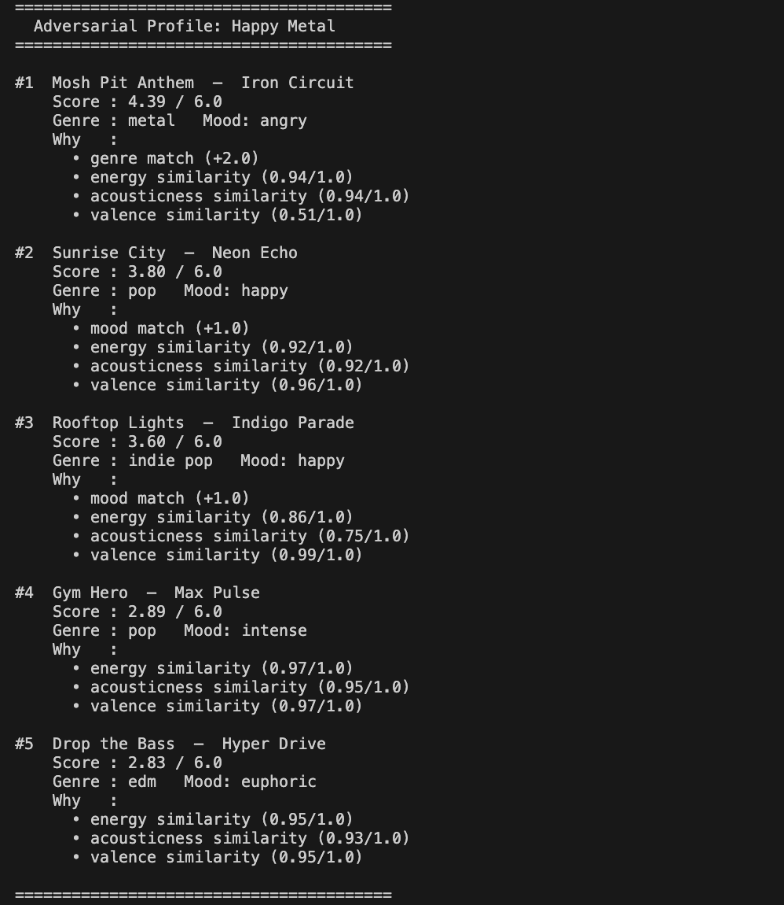
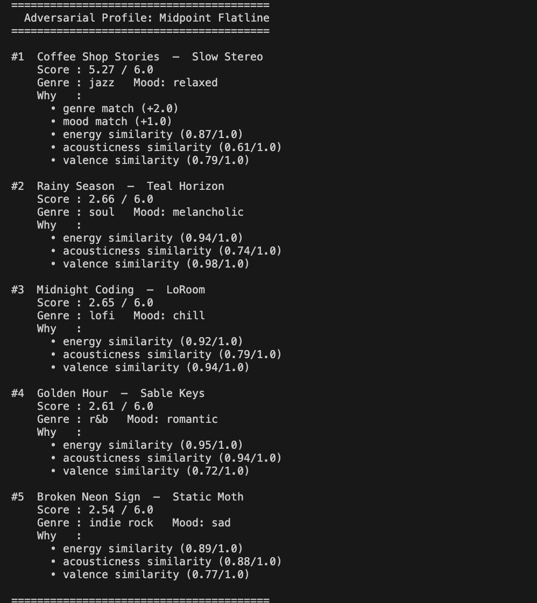
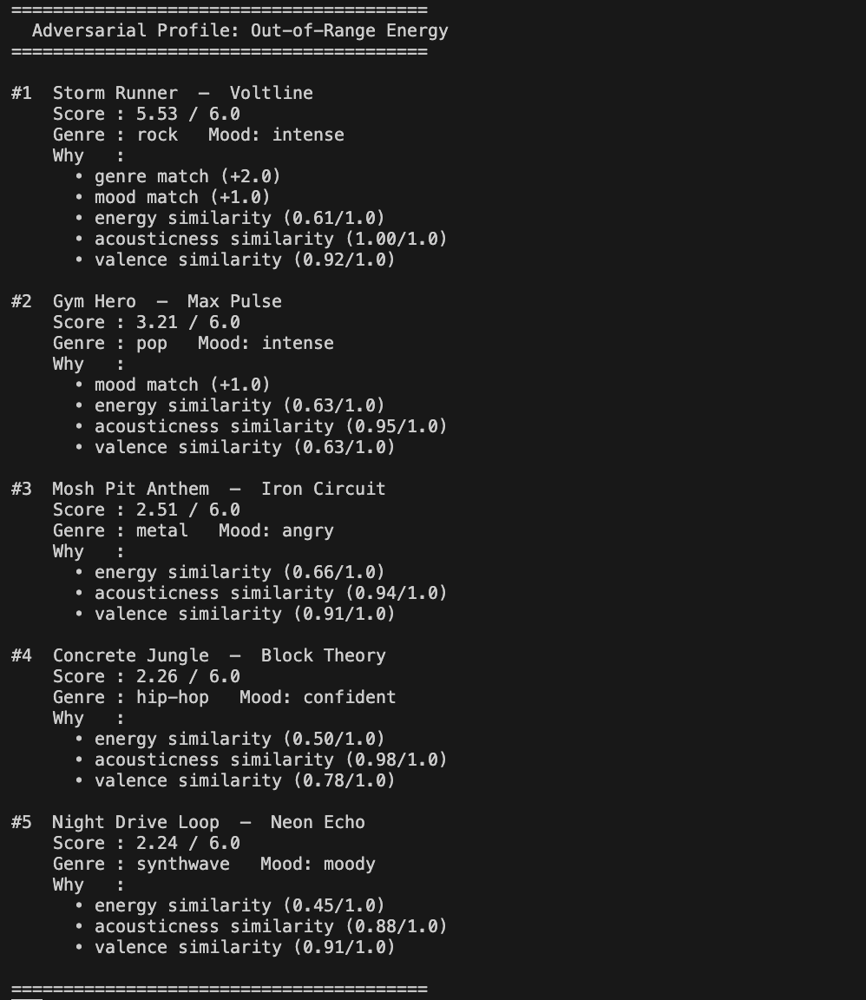

# 🎵 Music Recommender Simulation

## Project Summary

In this project you will build and explain a small music recommender system.

Your goal is to:

- Represent songs and a user "taste profile" as data
- Design a scoring rule that turns that data into recommendations
- Evaluate what your system gets right and wrong
- Reflect on how this mirrors real world AI recommenders

Replace this paragraph with your own summary of what your version does.

---

## How The System Works

Real-world recommenders like Spotify or YouTube build a picture of your taste by tracking listening behavior — skips, replays, saves — and combining that with content features like genre, tempo, and mood. Many also use collaborative filtering, recommending songs that people with similar habits have enjoyed. My version skips the behavioral layer entirely and works from explicit preferences: it compares a user's stated taste profile directly against each song's attributes and scores how well they match. The priority is transparency. Every recommendation can be traced back to a clear, readable rule rather than a black-box model.

**Song features:**
- `genre` — musical category (e.g. pop, hip-hop, jazz)
- `mood` — emotional tone (e.g. happy, melancholic, energetic)
- `energy` — intensity level, 0.0 to 1.0
- `tempo_bpm` — beats per minute
- `valence` — musical positivity, 0.0 to 1.0
- `danceability` — how suitable it is for dancing, 0.0 to 1.0
- `acousticness` — how acoustic vs. electronic, 0.0 to 1.0

**UserProfile features:**
- `favorite_genre` — the genre the user most prefers
- `favorite_mood` — the mood the user most prefers
- `target_energy` — the energy level the user wants, 0.0 to 1.0
- `target_acousticness` — how acoustic the user wants the sound to be, 0.0 to 1.0
- `target_valence` — the musical positivity the user wants, 0.0 to 1.0

---

### Algorithm Recipe

Each song is scored on a scale from **0.0 to 6.0**. Higher is a better match.

| Feature | Points | How it's calculated |
|---|---|---|
| Genre match | +2.0 | Exact match between `song.genre` and `user.favorite_genre` |
| Mood match | +1.0 | Exact match between `song.mood` and `user.favorite_mood` |
| Energy similarity | 0.0 – 1.0 | `1 - abs(song.energy - user.target_energy)` |
| Acousticness similarity | 0.0 – 1.0 | `1 - abs(song.acousticness - user.target_acousticness)` |
| Valence similarity | 0.0 – 1.0 | `1 - abs(song.valence - user.target_valence)` |

The top `k` songs by score are returned as recommendations.

**Why these weights?**
Genre carries the most weight (2.0) because a genre mismatch is a hard preference violation — no amount of energy or acousticness tuning should push a metal song to the top of a lofi user's list. Mood gets half as much (1.0) because it is important but softer — a "chill" song can work for a user who asked for "focused." The three continuous features each cap at 1.0, so together they can match or beat genre weight, but no single audio nuance alone dominates the result.

---

### Expected Biases

- **Genre-dominant results** — because genre is worth 2× mood and 2× any single continuous feature, two songs with the same genre will always outscore a perfect continuous-feature match from a different genre. Users who enjoy cross-genre listening may find results too narrow.
- **Catalog coverage bias** — the 20-song catalog has uneven genre distribution (e.g. multiple lofi tracks, only one classical). Genres with more catalog entries have a higher chance of appearing in top results, not because they fit better, but because there are more candidates.
- **Exact-match brittleness** — genre and mood use exact string matching. A song tagged `"indie pop"` will score 0 for a user whose `favorite_genre` is `"pop"`, even though the fit is close. Real-world systems use embeddings or genre hierarchies to avoid this cliff.
- **No behavioral signal** — the profile is a fixed snapshot. It cannot learn that this particular user skips acoustic songs despite high `target_acousticness`, or that they always replay tracks with high valence. Every session starts from the same static weights.

---

## Getting Started

### Setup

1. Create a virtual environment (optional but recommended):

   ```bash
   python -m venv .venv
   source .venv/bin/activate      # Mac or Linux
   .venv\Scripts\activate         # Windows

2. Install dependencies

```bash
pip install -r requirements.txt
```

3. Run the app:

```bash
python -m src.main
```

### Running Tests

Run the starter tests with:

```bash
pytest
```

You can add more tests in `tests/test_recommender.py`.

---

## Adversarial / Edge-Case Profile Results

These profiles are designed to stress-test the scoring logic by exposing situations where it may produce unexpected or misleading results.

### 1. High-Energy Sad
A user who wants intense energy but very low valence (sad). High-energy songs tend to have high valence, so the two targets fight each other.



---

### 2. Ghost Genre
A genre (`bossa nova`) that does not exist in the catalog. No song ever earns the +2.0 genre bonus, so rankings collapse to a 4-point range driven only by mood and continuous features.



---

### 3. Dead Zone
All continuous targets set to 0.0. The similarity formula rewards songs with near-zero energy, acousticness, and valence — penalising most real songs equally.



---

### 4. Max Everything
All continuous targets at 1.0, including both high energy and high acousticness — a physically contradictory combination the scorer cannot detect.



---

### 5. Happy Metal
The catalog only has `metal/angry`, not `metal/happy`. The +2.0 genre bonus pulls the angry metal song to #1 even though the mood is completely wrong.



---

### 6. Midpoint Flatline
All continuous targets at 0.5, making every song equally mediocre on numeric features. The flat +2/+1 bonuses become the only signal.



---

### 7. Out-of-Range Energy
`target_energy` set to 1.3 (outside the valid 0–1 range). No error is raised — scores are silently wrong for every song.



---

## Experiments You Tried

Use this section to document the experiments you ran. For example:

- What happened when you changed the weight on genre from 2.0 to 0.5
- What happened when you added tempo or valence to the score
- How did your system behave for different types of users

---

## Limitations and Risks

Summarize some limitations of your recommender.

Examples:

- It only works on a tiny catalog
- It does not understand lyrics or language
- It might over favor one genre or mood

You will go deeper on this in your model card.

---

## Reflection

Read and complete `model_card.md`:

[**Model Card**](model_card.md)

Write 1 to 2 paragraphs here about what you learned:

- about how recommenders turn data into predictions
- about where bias or unfairness could show up in systems like this


---

## 7. `model_card_template.md`

Combines reflection and model card framing from the Module 3 guidance. :contentReference[oaicite:2]{index=2}  

```markdown
# 🎧 Model Card - Music Recommender Simulation

## 1. Model Name

Give your recommender a name, for example:

> VibeFinder 1.0

---

## 2. Intended Use

- What is this system trying to do
- Who is it for

Example:

> This model suggests 3 to 5 songs from a small catalog based on a user's preferred genre, mood, and energy level. It is for classroom exploration only, not for real users.

---

## 3. How It Works (Short Explanation)

Describe your scoring logic in plain language.

- What features of each song does it consider
- What information about the user does it use
- How does it turn those into a number

Try to avoid code in this section, treat it like an explanation to a non programmer.

---

## 4. Data

Describe your dataset.

- How many songs are in `data/songs.csv`
- Did you add or remove any songs
- What kinds of genres or moods are represented
- Whose taste does this data mostly reflect

---

## 5. Strengths

Where does your recommender work well

You can think about:
- Situations where the top results "felt right"
- Particular user profiles it served well
- Simplicity or transparency benefits

---

## 6. Limitations and Bias

Where does your recommender struggle

Some prompts:
- Does it ignore some genres or moods
- Does it treat all users as if they have the same taste shape
- Is it biased toward high energy or one genre by default
- How could this be unfair if used in a real product

---

## 7. Evaluation

How did you check your system

Examples:
- You tried multiple user profiles and wrote down whether the results matched your expectations
- You compared your simulation to what a real app like Spotify or YouTube tends to recommend
- You wrote tests for your scoring logic

You do not need a numeric metric, but if you used one, explain what it measures.

---

## 8. Future Work

If you had more time, how would you improve this recommender

Examples:

- Add support for multiple users and "group vibe" recommendations
- Balance diversity of songs instead of always picking the closest match
- Use more features, like tempo ranges or lyric themes

---

## 9. Personal Reflection

A few sentences about what you learned:

- What surprised you about how your system behaved
- How did building this change how you think about real music recommenders
- Where do you think human judgment still matters, even if the model seems "smart"

