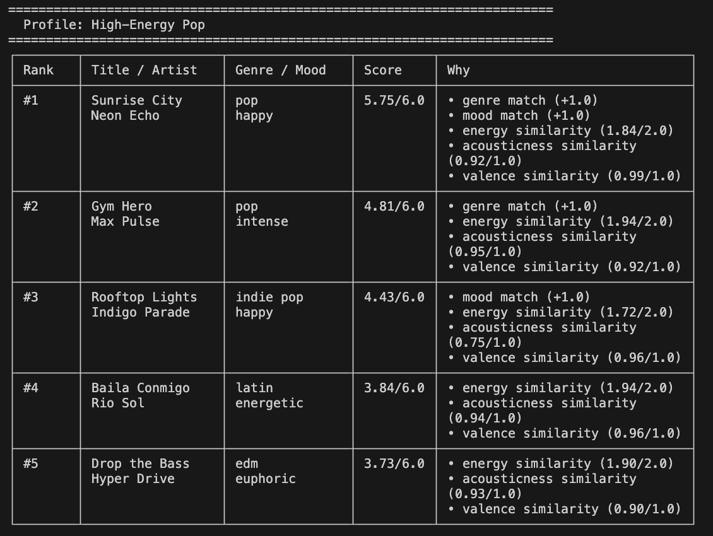
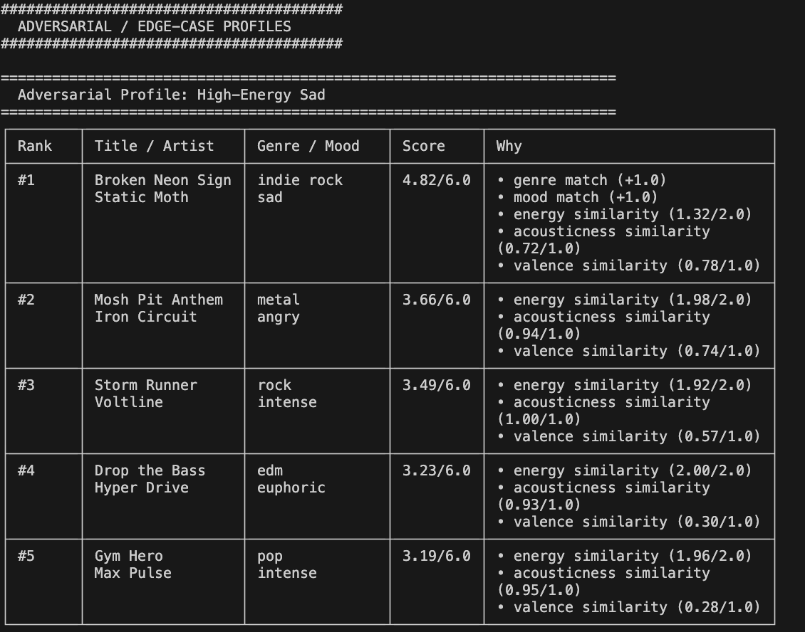
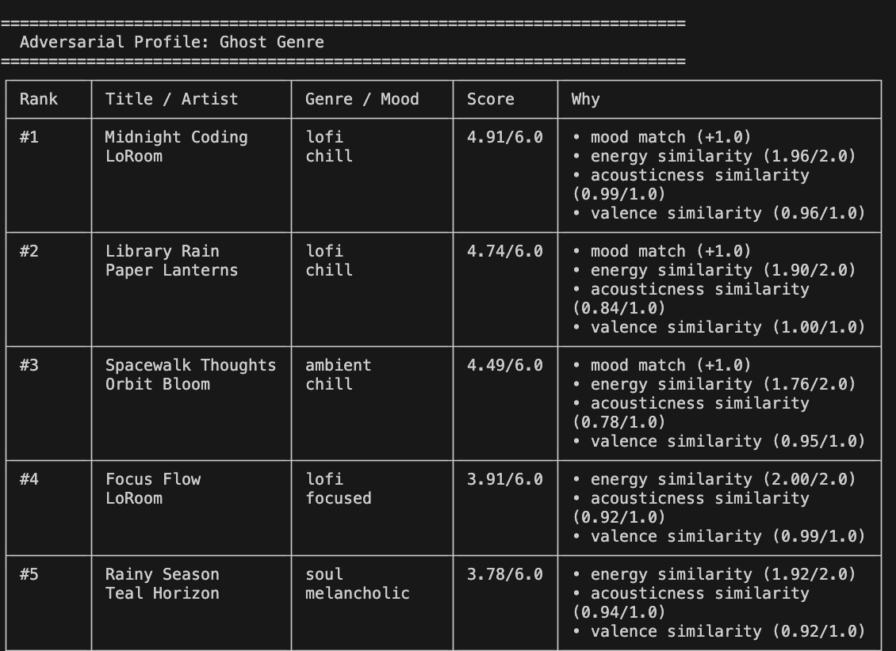
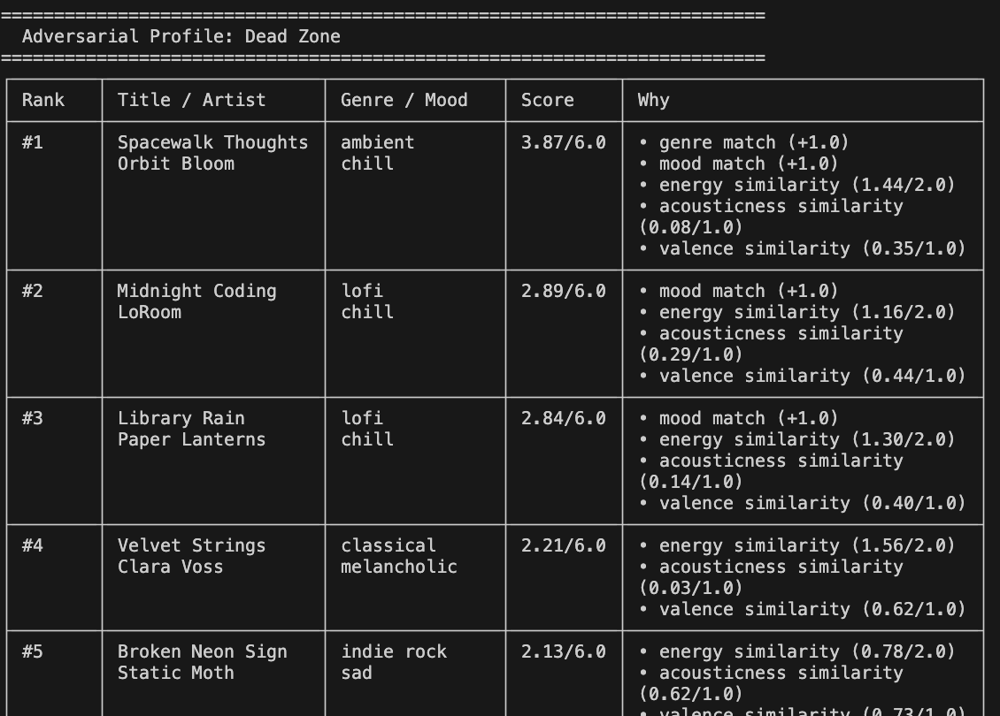
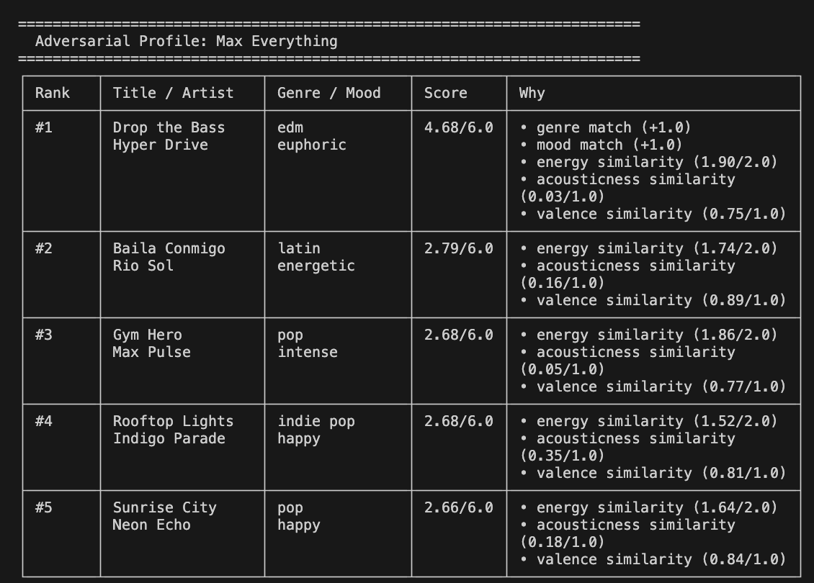
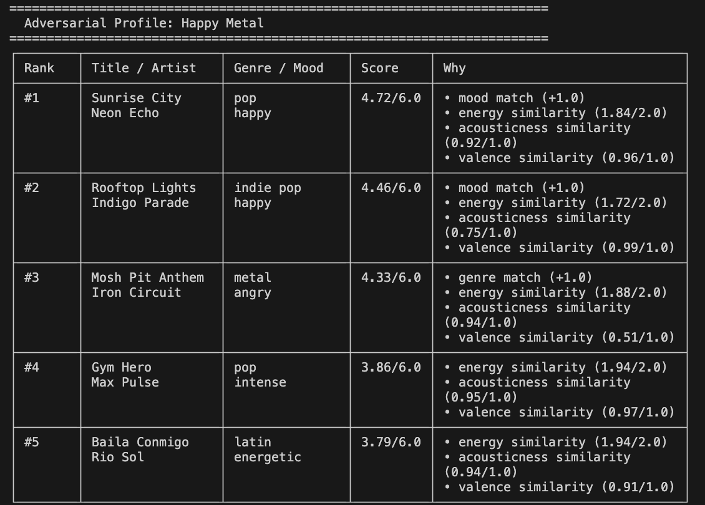
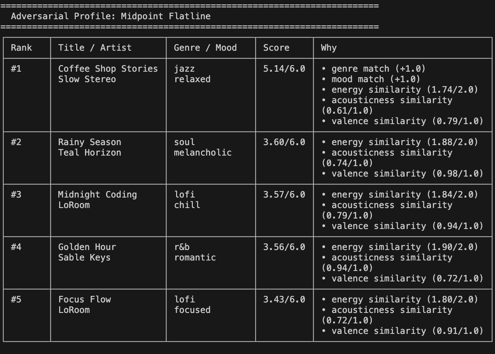
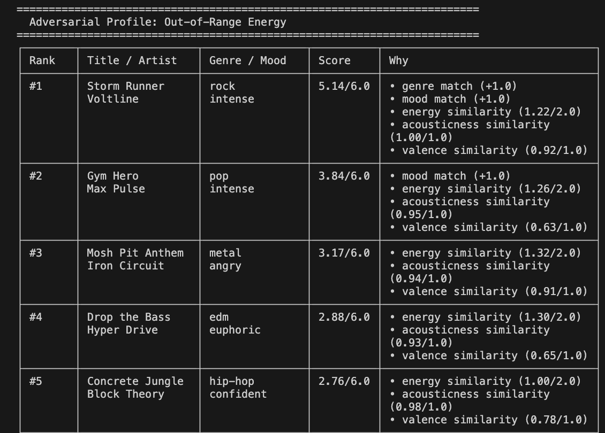

# 🎵 Music Recommender Simulation

## Project Summary

This project builds a small music recommender called SoundMatch 1.0. It scores each song in a 20-song catalog against a user's taste profile and returns the top 5 matches. The scoring is based on five features: genre, mood, energy, acousticness, and valence. Each feature contributes a fixed number of points, and the song with the highest total score is recommended first.

The project goes beyond just getting recommendations to work. It tests where the system breaks. Seven adversarial profiles were designed to expose weaknesses like missing genres, contradictory preferences, and out-of-range inputs. A weight-shift experiment (doubling energy, halving genre) was also run to measure how sensitive the rankings are to scoring decisions. The main finding is that no single set of weights produces good results for every type of user.

---

## How The System Works

Real-world recommenders like Spotify or YouTube build a picture of your taste by tracking listening behavior (skips, replays, saves) and combining that with content features like genre, tempo, and mood. Many also use collaborative filtering, recommending songs that people with similar habits have enjoyed. My version skips the behavioral layer entirely and works from explicit preferences: it compares a user's stated taste profile directly against each song's attributes and scores how well they match. The priority is transparency. Every recommendation can be traced back to a clear, readable rule rather than a black-box model.

**Song features:**

- `genre` — musical category (e.g. pop, hip-hop, jazz)
- `mood` — emotional tone (e.g. happy, melancholic, energetic)
- `energy` — intensity level, 0.0 to 1.0
- `tempo_bpm` — beats per minute
- `valence` — musical positivity, 0.0 to 1.0
- `danceability` — how suitable it is for dancing, 0.0 to 1.0
- `acousticness` — how acoustic vs. electronic, 0.0 to 1.0

**UserProfile features:**

- `favorite_genre` — the genre the user most prefers
- `favorite_mood` — the mood the user most prefers
- `target_energy` — the energy level the user wants, 0.0 to 1.0
- `target_acousticness` — how acoustic the user wants the sound to be, 0.0 to 1.0
- `target_valence` — the musical positivity the user wants, 0.0 to 1.0

---

### Algorithm Recipe

Each song is scored on a scale from **0.0 to 6.0**. Higher is a better match.

| Feature                 | Points    | How it's calculated                                        |
| ----------------------- | --------- | ---------------------------------------------------------- |
| Genre match             | +2.0      | Exact match between `song.genre` and `user.favorite_genre` |
| Mood match              | +1.0      | Exact match between `song.mood` and `user.favorite_mood`   |
| Energy similarity       | 0.0 – 1.0 | `1 - abs(song.energy - user.target_energy)`                |
| Acousticness similarity | 0.0 – 1.0 | `1 - abs(song.acousticness - user.target_acousticness)`    |
| Valence similarity      | 0.0 – 1.0 | `1 - abs(song.valence - user.target_valence)`              |

The top `k` songs by score are returned as recommendations.

**Why these weights?**
Genre carries the most weight (2.0) because a genre mismatch is a hard preference violation — no amount of energy or acousticness tuning should push a metal song to the top of a lofi user's list. Mood gets half as much (1.0) because it is important but softer — a "chill" song can work for a user who asked for "focused." The three continuous features each cap at 1.0, so together they can match or beat genre weight, but no single audio nuance alone dominates the result.

---

### Expected Biases

- **Genre-dominant results** — because genre is worth 2× mood and 2× any single continuous feature, two songs with the same genre will always outscore a perfect continuous-feature match from a different genre. Users who enjoy cross-genre listening may find results too narrow.
- **Catalog coverage bias** — the 20-song catalog has uneven genre distribution (e.g. multiple lofi tracks, only one classical). Genres with more catalog entries have a higher chance of appearing in top results, not because they fit better, but because there are more candidates.
- **Exact-match brittleness** — genre and mood use exact string matching. A song tagged `"indie pop"` will score 0 for a user whose `favorite_genre` is `"pop"`, even though the fit is close. Real-world systems use embeddings or genre hierarchies to avoid this cliff.
- **No behavioral signal** — the profile is a fixed snapshot. It cannot learn that this particular user skips acoustic songs despite high `target_acousticness`, or that they always replay tracks with high valence. Every session starts from the same static weights.

---

## Getting Started

### Setup

1. Create a virtual environment (optional but recommended):

   ```bash
   python -m venv .venv
   source .venv/bin/activate      # Mac or Linux
   .venv\Scripts\activate         # Windows

   ```

2. Install dependencies

```bash
pip install -r requirements.txt
```

3. Run the app:

```bash
python -m src.main
```

### Sample Output



---

### Running Tests

Run the starter tests with:

```bash
pytest
```

You can add more tests in `tests/test_recommender.py`.

---

## Adversarial / Edge-Case Profile Results

These profiles are designed to stress-test the scoring logic by exposing situations where it may produce unexpected or misleading results.

### 1. High-Energy Sad

A user who wants intense energy but very low valence (sad). High-energy songs tend to have high valence, so the two targets fight each other.



---

### 2. Ghost Genre

A genre (`bossa nova`) that does not exist in the catalog. No song ever earns the +2.0 genre bonus, so rankings collapse to a 4-point range driven only by mood and continuous features.



---

### 3. Dead Zone

All continuous targets set to 0.0. The similarity formula rewards songs with near-zero energy, acousticness, and valence (penalising most real songs equally).



---

### 4. Max Everything

All continuous targets at 1.0, including both high energy and high acousticness (a physically contradictory combination the scorer cannot detect).



---

### 5. Happy Metal

The catalog only has `metal/angry`, not `metal/happy`. The +2.0 genre bonus pulls the angry metal song to #1 even though the mood is completely wrong.



---

### 6. Midpoint Flatline

All continuous targets at 0.5, making every song equally mediocre on numeric features. The flat +2/+1 bonuses become the only signal.



---

### 7. Out-of-Range Energy

`target_energy` set to 1.3 (outside the valid 0–1 range). No error is raised — scores are silently wrong for every song.



---

## Experiments You Tried

**Experiment 1: Weight Shift — halve genre, double energy**

Genre bonus was reduced from +2.0 to +1.0 and energy similarity was scaled from 0–1.0 to 0–2.0, keeping the max score at 6.0. For normal profiles like High-Energy Pop and Chill Lofi, the #1 result did not change — the right song still came first. For the Happy Metal adversarial profile, the result improved: the wrong metal/angry song dropped from #1 to #3, and a pop/happy song correctly took the top spot because mood and energy together outweighed the genre mismatch. However, for profiles that wanted calm music, results got worse — doubling energy penalized low-energy preferences more harshly because most songs in the catalog skew high-energy.

**Experiment 2: Adversarial profiles**

Seven edge-case profiles were designed to stress-test the scoring logic. Key findings:

- **Ghost Genre** (bossa nova, not in catalog): the system returned plausible-looking results but scores compressed into a narrow band with no clear winner. The missing +1.0 genre bonus flattened everything.
- **Dead Zone** (all targets at 0.0): near-silent songs floated to the top because the formula rewards low values when the target is 0. The genre and mood bonuses were the only real signal.
- **Max Everything** (all targets at 1.0): high energy and high acousticness are contradictory, but the system never detected the conflict. It just averaged the penalties and returned results confidently.
- **Out-of-Range Energy** (target 1.3): no error was raised. Every song was silently scored with a wrong energy similarity and the system carried on as if nothing was wrong.

**Experiment 3: Normal vs. adversarial sensitivity**

After the weight shift, the top result changed in 4 of 7 adversarial profiles but only 1 of 3 normal profiles. This showed that typical users are relatively stable across weight choices, but edge-case users are highly sensitive to them. A system tuned for the average user will behave unpredictably for anyone outside that center.

---

## Limitations and Risks

- The catalog only has 20 songs. Rare genres like classical and folk have just one song each, so those users always get off-genre results in their top 5.
- Genre and mood use exact string matching. A song tagged "indie pop" scores zero for a user who likes "pop," even though the fit is close.
- The system always returns 5 results no matter what. There is no minimum score threshold, so it looks confident even when no good match exists.
- The energy gap is treated symmetrically — being too loud and being too quiet get the same penalty, which is not how most listeners actually feel.
- The profile never updates. If a user skips every high-energy song, the system will keep recommending them anyway.
- Out-of-range inputs like `target_energy: 1.3` produce no error — the scores are silently wrong.
- The dataset skews toward Western genres. K-pop, Afrobeats, reggae, and other global styles are not represented at all.

---

## Reflection

[**Model Card**](model_card.md)

Building this system showed me that a recommender is really just a set of priorities dressed up as math. Every weight is a decision about what matters most and that decision affects who gets good results and who gets ignored. When I doubled the energy weight and halved the genre weight, the rankings shifted in ways that helped some profiles and hurt others. There was no version of the weights that worked well for everyone. That was the clearest sign that recommenders are not neutral tools. They reflect the choices of whoever built them.

Bias showed up in places I did not expect. Users who like rare genres like classical or folk had almost no good candidates in the catalog, so their top 5 always included off-genre songs just to fill the list. Users who want calm music were quietly penalized because most songs in the catalog skew high-energy, and the formula treats being too loud and being too quiet as equal problems (even though they feel very different to a real listener). The system also had no way to say "I don't know". It always returned five confident-looking results, even when the best score was very low. That kind of false confidence is something real AI systems can have too, and it is worth watching for.

---
